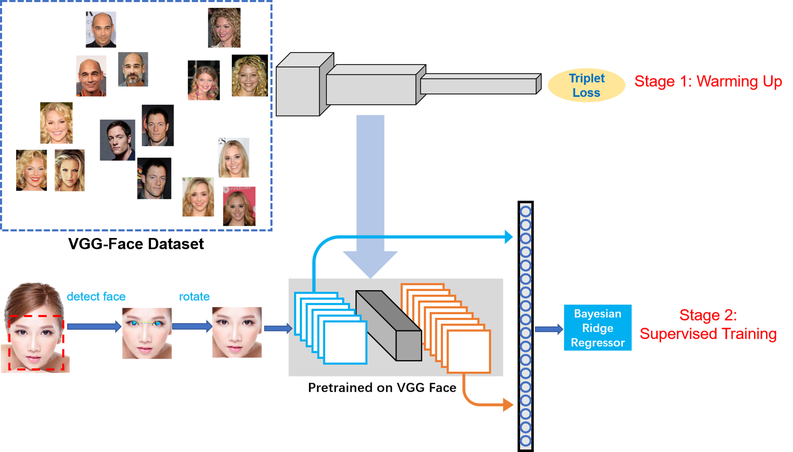
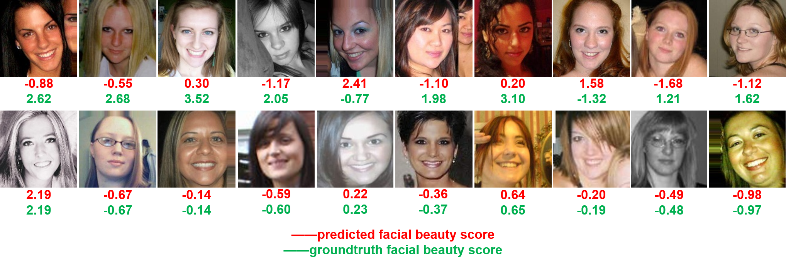

# Transferring Rich Deep Features for Facial Beauty Prediction

## Introduction
This repo provides the source code for our paper [Transferring Rich Deep 
Features for Facial Beauty Prediction](https://arxiv.org/pdf/1803.07253.pdf). This code has been tested on Ubuntu16
.04 with TensorFlow0.12.0, a newer version may bring you some trouble since TensorFlow's APIs always change after releasing a new version.

## Proposed Method


## Experiments
Our proposed two-stage method achieves state-of-the-art performance on [SCUT-FBP](http://www.hcii-lab.net/data/scut-fbp/en/introduce.html) and [Female Facial Beauty Dataset (ECCV2010) v1.0](https://www.researchgate.net/publication/261595808_Female_Facial_Beauty_Dataset_ECCV2010_v10) dataset.
TransFBP also achieves very competitive performance on [SCUT-FBP5500](https://arxiv.org/pdf/1801.06345.pdf) dataset.

* Evaluation with the SCUT-FBP Dataset

| Methods | PC |
| :---: |:---: |
| Combined Features+Gaussian Reg | 0.6482 |
| CNN-based | 0.8187 |
| Liu et al. | 0.6938 |
| KFME | 0.7988 |
| RegionScatNet | 0.83 |
| PI-CNN | 0.87 |
| **TransFBP (Ours)** | **0.8742** |

* Evaluation with the HotOrNot Dataset

| Methods | PC |
| :---: |:---: |
| Eigenface | 0.180 |
| Multiscale Model | 0.458 |
| Auto Encoder | 0.437 |
| Ours | 0.468 |

* Evaluation with the SCUT-FBP5500 Dataset

| Methods | PC |
| :---: |:---: |
| Geometric features + Gaussian Regression | 0.6738 |
| Geometric features + SVR | 0.6668 |
| 64UniSample + SVR | 0.8065 |
| AlexNet | 0.8298 |
| ResNet18 | 0.8513 |
| ResNeXt50 | 0.8777 |
| Ours | 0.8519 |


## Examples


## Citation 
If you find the code or the experimental results useful in your research, please consider citing our paper as:

```
@article{xu2018transferring,
  title={Transferring Rich Deep Features for Facial Beauty Prediction},
  author={Xu, Lu and Xiang, Jinhai and Yuan, Xiaohui},
  journal={arXiv preprint arXiv:1803.07253},
  year={2018}
}
```
